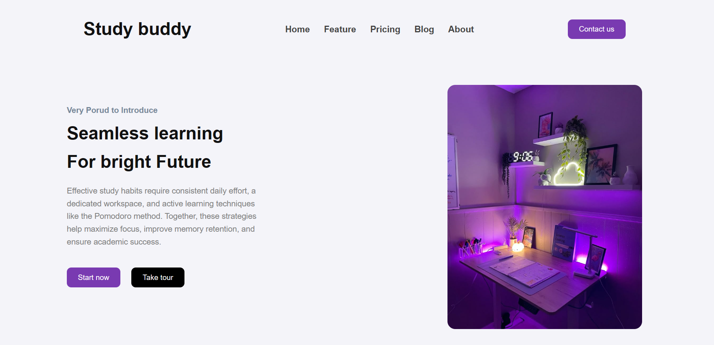

# 📚 Study Buddy Landing Page

A modern and responsive **Study Buddy Landing Page** built using **HTML and CSS**.

This project showcases a clean landing page design with a responsive navigation bar, hero section, call-to-action buttons, and an attractive study-themed layout.

<br>

# 🚀 Live Demo

🌐 **View Live Project:**
https://landing-page-eta-two-91.vercel.app/

<br>

# 📸 Screenshot

## Home Page



<br>
<br>

# ✨ Features

- Responsive landing page design
- Modern navigation bar
- Hero section with call-to-action buttons
- Clean and minimal UI
- Mobile-friendly layout
- Smooth and organized structure

<br>
<br>

# 🛠️ Tech Stack

| Technology | Purpose   |
| ---------- | --------- |
| HTML5      | Structure |
| CSS3       | Styling   |

<br>
<br>

# ⚙️ Installation

### Clone the repository

```bash
git clone https://github.com/ketanmakwana30/landing-page.git

```

### Navigate to Project Folder

```bash
cd landing-page
```

### Open the Project

Open the `index.html` file in your browser.

<br>

# 👨‍💻 Author

**Ketan Makwana**

GitHub: https://github.com/ketanmakwana30

Live Project: https://landing-page-eta-two-91.vercel.app/
